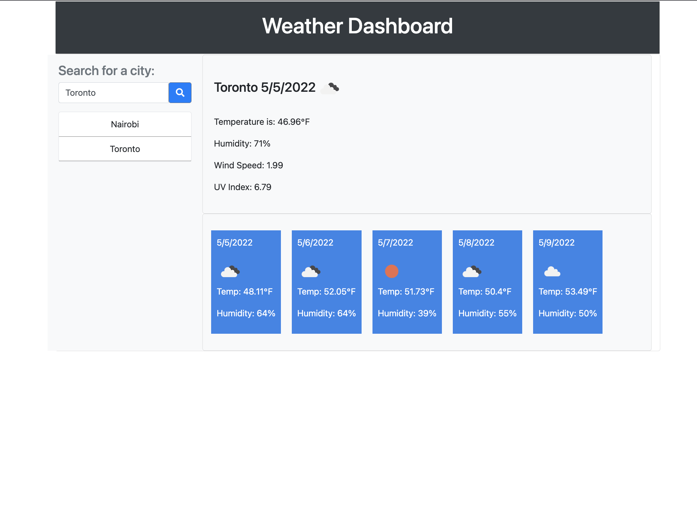

# my-weather-app
This is a weather app containing an API linked to openweathermap.org

# URLS to my work

Github Repo: https://github.com/kishan254/my-weather-app

Github Live: https://kishan254.github.io/my-weather-app/

# Screenshot of how the app looks

# additional notes

Due to my work commitments I have not been able to fully complete this app, in-which I have to input local storage and a method where user can save the cities for future use

If you have any suggestions pleae do so by commenting

Thank you