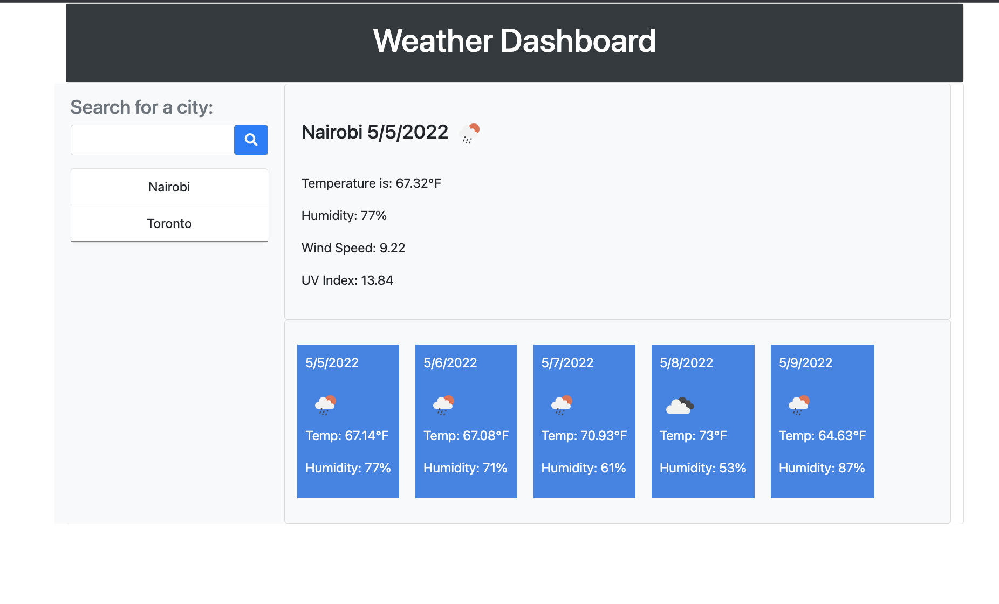
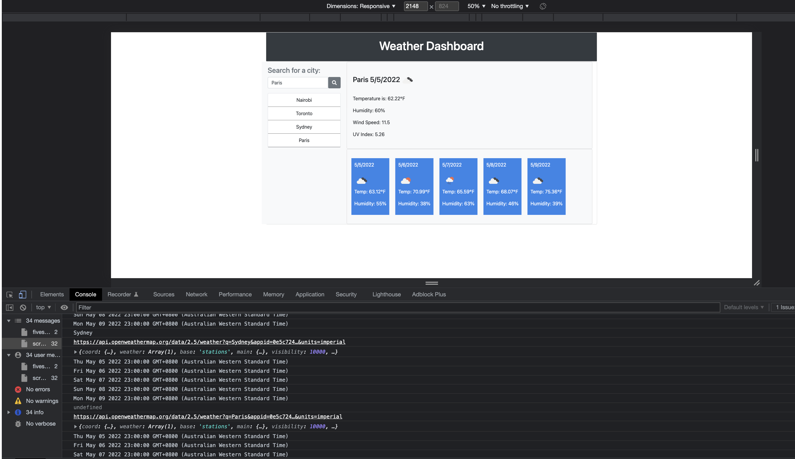

# my-weather-app
This is a weather app containing an API linked to openweathermap.org

Search any city and get to the wind, temperature, humidity and UV Index

Give it a try now

# URLS to my work

Github Repo: https://github.com/kishan254/my-weather-app

Github Live: https://kishan254.github.io/my-weather-app/

# Screenshot of how the app looks

## Technology

- HTML
- API Routes
- Javascript
- Local Storage

## Usage

In order to use this app, you will need to understand the following;

- HTML
- API Routes
- Javascript
- Local Storage

## Contribute

In order to contribute to this app, you will need to understand the following;

- HTML
- API Routes
- Javascript
- Local Storage

## Questions

Please click the links below

[Github] (https://github.com/kishan254)

Write me on;

[Email] (kishan.gosrani@hotmail.com)